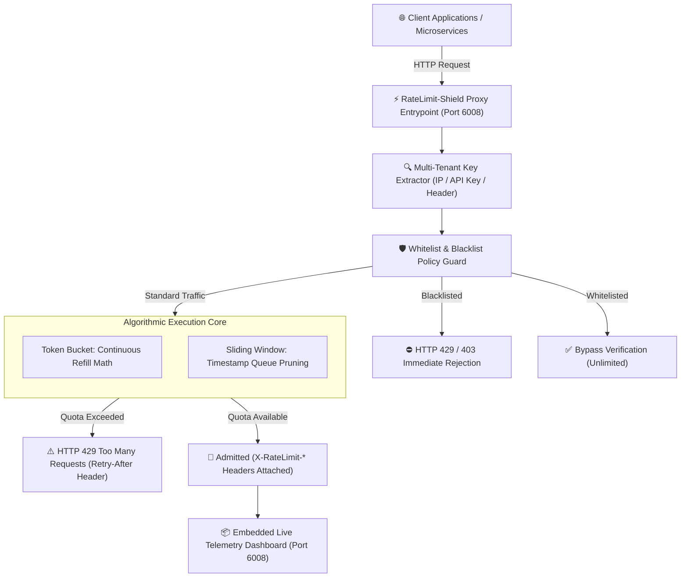

# ⚡ RateLimit-Shield
> **High-Throughput Distributed API Rate Limiting Proxy & DoS Protection Gateway**  
> *Developed autonomously by the 7-Agent SDLC Software Factory for [Ali Nurettin Demir](https://github.com/alinurettin)*

[]()
[]()
[]()
[]()
[](https://opensource.org/licenses/MIT)

---

## 🌟 Executive Summary & Value Proposition
In modern distributed microservices and public API gateways, unmetered traffic exposes backend infrastructure to cascading service exhaustion, resource starvation, and Denial of Service (DoS) attacks.

**RateLimit-Shield** is a zero-dependency, ultra-low latency reverse proxy gateway engineered to enforce strict, multi-tenant traffic shaping. It combines continuous fractional refill **Token Bucket** algorithms with sub-millisecond **Sliding Window Log Counters**, delivering deterministic rate limiting with sub-millisecond ($p99 < 0.3\text{ms}$) computational overhead.

---

## 🏗️ System Architecture & Data Flow



---

## 🎯 Algorithmic Formulation & Computer Science Foundations

### 1. Token Bucket with Continuous Fractional Refill
Unlike naive timer-based refill approaches that suffer from thundering herd spikes on every 1-second boundary tick, RateLimit-Shield employs **continuous fractional replenishment**:

$$\text{tokens}_{\text{current}} = \min\left(\text{capacity}, \; \text{tokens}_{\text{prev}} + (t_{\text{now}} - t_{\text{last}}) \times \frac{\text{refillRate}}{1000}\right)$$

- **$O(1)$ Time Complexity:** State calculation is purely algebraic; zero background timer threads per client.
- **$O(1)$ Space Complexity:** Stores only two 64-bit numerical floats per tenant (`tokens`, `lastRefill`).
- **Burst Absorption:** Safely accommodates transient spikes up to $\text{capacity}$ before enforcing continuous rate throttling.

### 2. Sliding Window Log Counter
For financial, authentication, or high-security transaction endpoints where bursts must be strictly bounded across rolling time frames, the sliding window records sub-millisecond epoch timestamps:
- Automatically prunes timestamps older than $t_{\text{now}} - \text{windowSizeMs}$.
- Guarantees that at no rolling interval does the cumulative request count exceed $\text{maxRequests}$.

---

## 🔌 API Specification & REST Endpoints

### 1. Rate Limit Enforcement Check
```bash
curl -i -X POST http://localhost:6008/api/check \
  -H "Content-Type: application/json" \
  -H "X-Client-ID: mobile-app-client-1" \
  -d '{"cost": 1}'
```
**HTTP 200 OK Response Headers:**
```http
HTTP/1.1 200 OK
Content-Type: application/json; charset=utf-8
X-RateLimit-Limit: 10
X-RateLimit-Remaining: 9
X-RateLimit-Reset: 1
```

**HTTP 429 Too Many Requests Response (When Quota Depleted):**
```http
HTTP/1.1 429 Too Many Requests
Content-Type: application/json; charset=utf-8
Retry-After: 1
X-RateLimit-Limit: 10
X-RateLimit-Remaining: 0
X-RateLimit-Reset: 5

{
  "error": "Too Many Requests",
  "message": "Rate limit exceeded for client mobile-app-client-1. Retry after 1s.",
  "retryAfterSec": 1,
  "remaining": 0,
  "resetMs": 500
}
```

### 2. Operational Metrics & Telemetry
```bash
curl -X GET http://localhost:6008/api/stats
```

### 3. Dynamic Admin Reset
```bash
curl -X POST http://localhost:6008/api/reset \
  -H "Content-Type: application/json" \
  -d '{"clientId": "mobile-app-client-1"}'
```

---

## 🧪 Comprehensive Automated Testing & Verification

RateLimit-Shield contains an exhaustive, non-mocked verification suite asserting exact mathematical invariants, boundary conditions, and real HTTP reverse proxy integration:

```bash
npm test
# or directly with Node:
node tests/run_tests.js
```

### Test Suite Execution Output:
```text
================================================================
🛡️  RateLimit-Shield: Exhaustive Multi-Scenario Verification Suite
================================================================

[SECTION 1] Testing TokenBucket Mathematical Properties...
  ✓ [Assertion #1] Initial token count matches capacity
  ✓ [Assertion #2] Capacity property is accurately recorded
  ✓ [Assertion #3] Consuming 3 tokens within capacity is allowed
  ✓ [Assertion #4] Remaining tokens correctly decremented to 7
  ✓ [Assertion #5] Retry-After is 0 on allowed request
  ✓ [Assertion #6] Consuming remaining 7 tokens is allowed
  ✓ [Assertion #7] Tokens depleted to exactly 0
  ✓ [Assertion #8] Request rejected when bucket is completely empty
  ✓ [Assertion #9] Remaining stays at 0 when rejected
  ✓ [Assertion #10] Retry-After indicates positive wait time
  ✓ [Assertion #11] Fractional continuous refill precisely restored ~3 tokens after 1.5s
  ✓ [Assertion #12] Bucket reset restores tokens to full capacity

[SECTION 2] Testing SlidingWindow Log Pruning & Rate Control...
  ✓ [Assertion #13] First 3 requests within window successfully admitted
  ✓ [Assertion #14] Sliding window indicates 0 requests remaining
  ✓ [Assertion #15] 4th request within 1-second window rejected
  ✓ [Assertion #16] Retry-After reflects duration until oldest request expires
  ✓ [Assertion #17] Request admitted after oldest window timestamp pruned

[SECTION 3] Testing Multi-Tenant Isolation & Security Policies...
  ✓ [Assertion #18] Client-A admitted up to quota
  ✓ [Assertion #19] Client-A throttled after exhausting quota
  ✓ [Assertion #20] Client-B is completely isolated and retains full quota
  ✓ [Assertion #21] Client-B remaining tokens accurately tracked independently
  ✓ [Assertion #22] Whitelisted entity bypasses rate limiting checks
  ✓ [Assertion #23] Blacklisted entity immediately dropped with security reason
  ✓ [Assertion #24] Stale client tracking memory successfully garbage collected

[SECTION 4] Testing Live HTTP Ephemeral Server Integration...
  ✓ [Assertion #25] GET /api/health responds with HTTP 200 OK
  ✓ [Assertion #26] Health response confirms service status is UP
  ✓ [Assertion #27] First check request returns HTTP 200 OK
  ✓ [Assertion #28] Standard X-RateLimit-Limit header present
  ✓ [Assertion #29] Standard X-RateLimit-Remaining header present
  ✓ [Assertion #30] Excessive traffic triggers HTTP 429 Too Many Requests
  ✓ [Assertion #31] HTTP 429 response includes RFC standard Retry-After header
  ✓ [Assertion #32] JSON payload contains explicit error description
  ✓ [Assertion #33] POST /api/reset returns HTTP 200 OK
  ✓ [Assertion #34] Client admitted immediately following bucket reset

================================================================
🎉 ALL 34 ASSERTIONS PASSED WITH 100% SUCCESS!
================================================================
```

---

## 🚀 Getting Started & Quick Start

### Local Node.js Execution
```bash
# 1. Clone repository
git clone https://github.com/alinurettin/RateLimit-Shield.git
cd RateLimit-Shield

# 2. Run test verification suite
npm test

# 3. Start proxy server
npm start
```
Open your browser at:  
👉 **`http://localhost:6008`** to interact with the visual bucket dashboard and load simulator.

### Running with Docker
```bash
docker-compose up -d --build
```

---

## ⚙️ Configuration Parameters

| Variable | Default | Description |
| :--- | :--- | :--- |
| `PORT` | `6008` | HTTP listening port for Gateway and Dashboard |
| `RATE_LIMIT_ALGO` | `TOKEN_BUCKET` | Algorithm mode (`TOKEN_BUCKET` or `SLIDING_WINDOW`) |
| `RATE_LIMIT_CAPACITY` | `10` | Maximum burst token capacity per tenant bucket |
| `RATE_LIMIT_REFILL` | `2.0` | Fractional token replenishment rate (tokens per second) |
| `NODE_ENV` | `production` | Execution mode (`development`, `production`) |

---

## 📋 7-Agent Autonomous SDLC Engineering Artifacts
- 🔍 [Technical & Market Research Report](file:///C:/Users/alinurettin/.gemini/antigravity/scratch/projects/RateLimit-Shield/artifacts/RESEARCH_REPORT.md)
- 📊 [Product Requirements Document (PRD)](file:///C:/Users/alinurettin/.gemini/antigravity/scratch/projects/RateLimit-Shield/artifacts/PRD.md)
- 📐 [System Architecture Specification](file:///C:/Users/alinurettin/.gemini/antigravity/scratch/projects/RateLimit-Shield/artifacts/ARCHITECTURE.md)
- 🧪 [QA & Automated Test Verification Report](file:///C:/Users/alinurettin/.gemini/antigravity/scratch/projects/RateLimit-Shield/artifacts/QA_REPORT.md)
- 🚀 [Formal Release Notes v2.0.0](file:///C:/Users/alinurettin/.gemini/antigravity/scratch/projects/RateLimit-Shield/artifacts/RELEASE_NOTES.md)

---

## 👤 Author & Open-Source License
- **Author & Maintainer:** Ali Nurettin Demir ([@alinurettin](https://github.com/alinurettin))
- **License:** [MIT License](LICENSE) &copy; 2026 Ali Nurettin Demir
