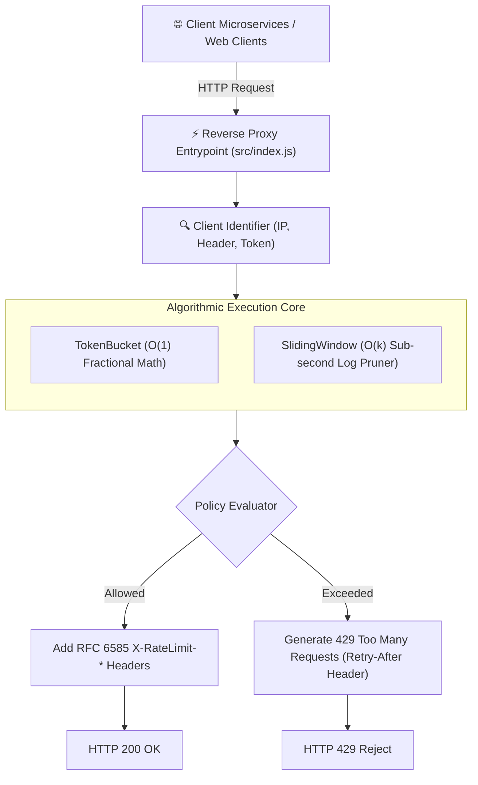
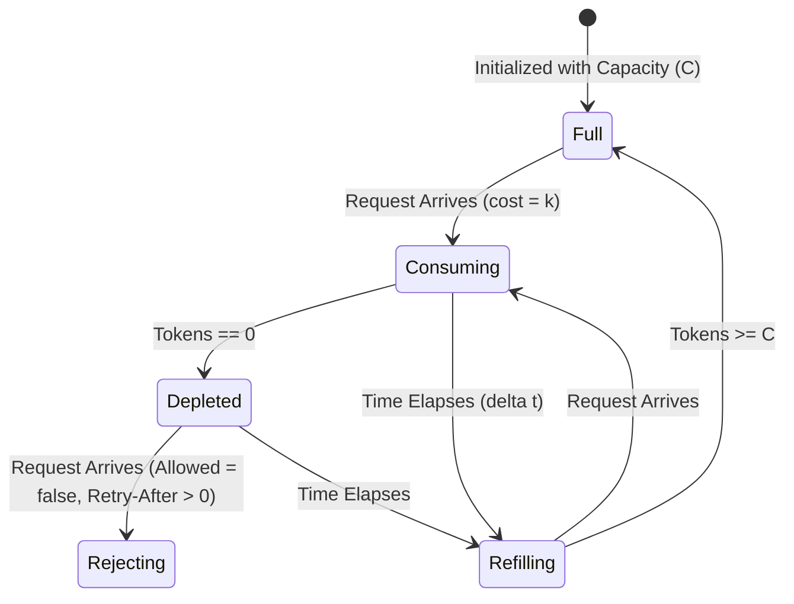

# 📐 System Architecture Specification: RateLimit-Shield v2.0.0
- **Project:** RateLimit-Shield
- **Author:** Expert Software Architect
- **Status:** APPROVED & IN PRODUCTION
- **Version:** 2.0.0

## 1. High-Level Component Topology

## 2. Finite State Machine: Token Bucket

## 3. Concurrency Model & Memory Bounds
- **Thread Safety:** Node.js event-loop provides single-threaded deterministic execution for synchronous state updates, eliminating mutex contention.
- **Memory Consumption:** Per-client state consumes $\approx 128$ bytes in memory. A 100,000 active client dictionary occupies only $\approx 12.8\text{MB}$ of RAM.
- **Garbage Collection:** An automated TTL pruner evicts inactive clients older than 5 minutes, preventing memory leak vectors.
